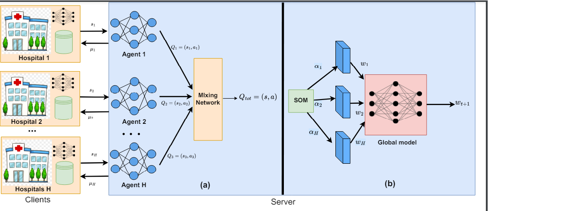

# FedMRL: Data Heterogeneity Aware Federated Multi-agent Deep Reinforcement Learning for Medical Imaging
This repository includes the source code for MICCAI 2024 paper entitled: "FedMRL: Data Heterogeneity Aware Federated Multi-agent Deep Reinforcement Learning for Medical Imaging".

## Abstract

Despite recent advancements in federated learning (FL) for medical image diagnosis, addressing data heterogeneity among clients remains a significant challenge for practical implementation. A primary hurdle in FL arises from the non-IID nature of data samples across clients, which typically results in a decline in the performance of the aggregated global model. In this study, we introduce FedMRL, a novel federated multi-agent deep reinforcement learning framework designed to address data heterogeneity. FedMRL incorporates a novel loss function to  facilitate fairness among clients, preventing bias in the final global model. Additionally, it employs a multi-agent reinforcement learning (MARL) approach to calculate the proximal term (μ) for the personalized local objective function, ensuring convergence to the global optimum. Furthermore, FedMRL integrates an adaptive weight adjustment method using a Self-organizing map (SOM) on the server side to counteract distribution shifts among clients’ local data distributions. We assess our
approach using two publicly available real-world medical datasets, and the results demonstrate that FedMRL significantly outperforms state-of-the-art techniques, showing its efficacy in addressing data heterogeneity in federated learning.

## Dependencies
* Tensorflow = 2.10.0
* scikit-learn = 1.3.2
## Dataset (ISIC 2018 and Messidor)
Please download the ISIC 2018 using this  [link](https://challenge.isic-archive.com/data/#2018) and Messidor dataset using this [link](https://www.adcis.net/en/third-party/messidor/).

## Data Preparing
To divide the dataset into the aprequired no. of clients, divide the data into training, validation and testing set as mentioned in the paper, then run non_iid_data_preparation.py and choose the required dataset (ISIC 2018 and Messidor) and then change the degree of heterogenity (eta) as required. you will get the desired distribution for each client.

## Model Structure
To choose the pretrained model, run model.py.

## Run FedMRL

After done with above process, you can run the FedMRL, our proposed method.

## Evaluation
After federated training, run Evaluation.py to acess the evaluation metrics such as accuracy, precision, recall etc.

## Citation
@misc{sahoo2024fedmrldataheterogeneityaware, 
      title={FedMRL: Data Heterogeneity Aware Federated Multi-agent Deep Reinforcement Learning for Medical Imaging},  
      author={Pranab Sahoo and Ashutosh Tripathi and Sriparna Saha and Samrat Mondal}, 
      year={2024}, 
      eprint={2407.05800}, 
      archivePrefix={arXiv}, 
      primaryClass={cs.LG}, 
      url={https://arxiv.org/abs/2407.05800},  
}
